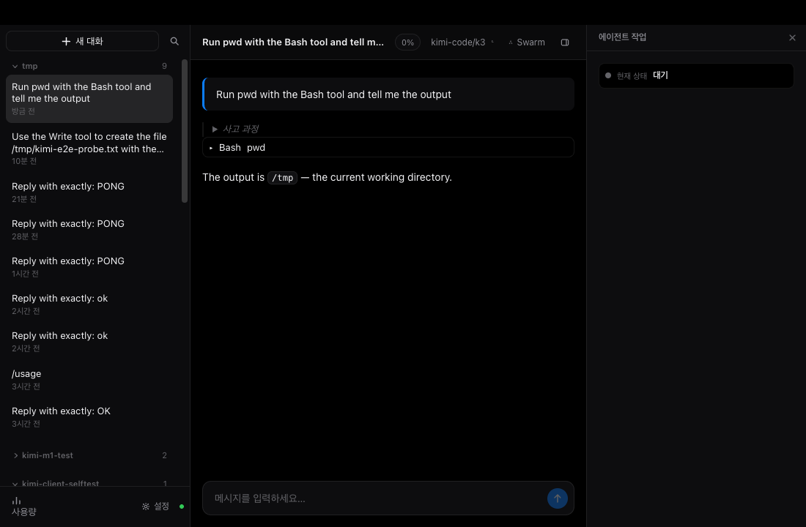
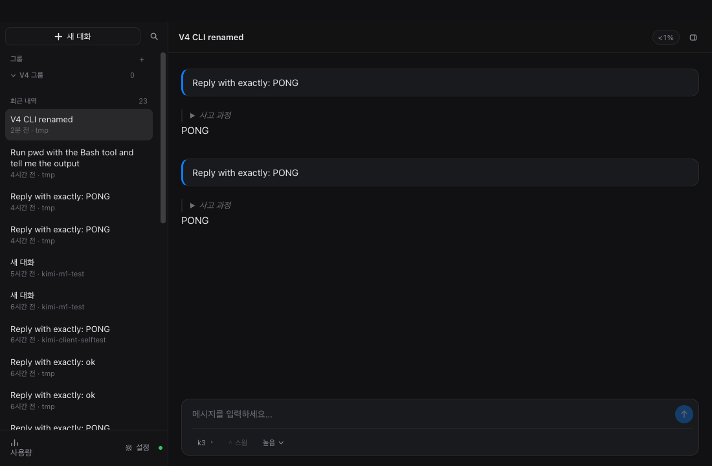
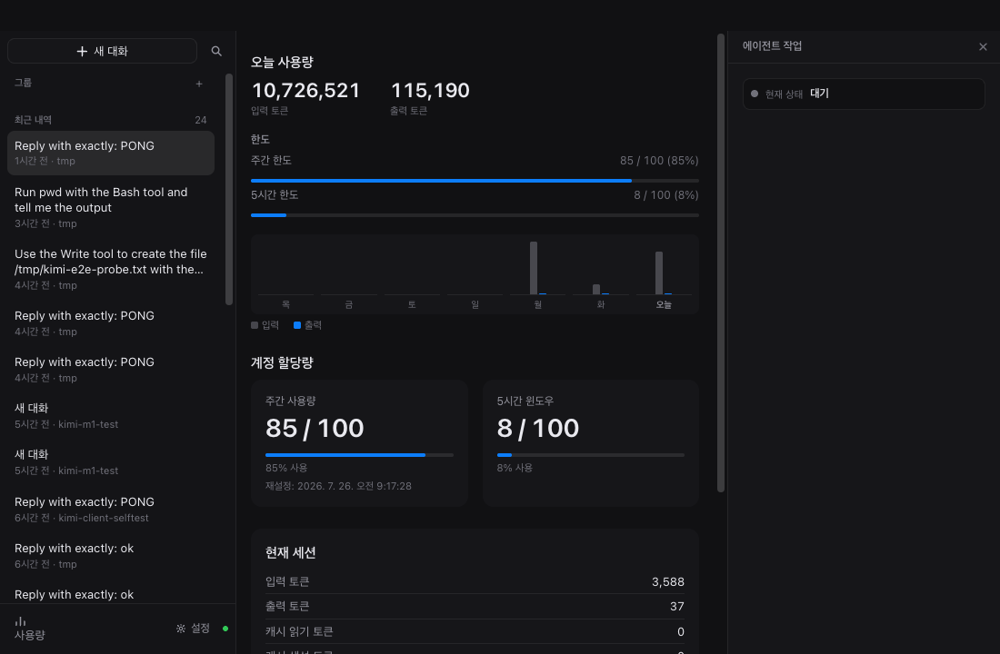
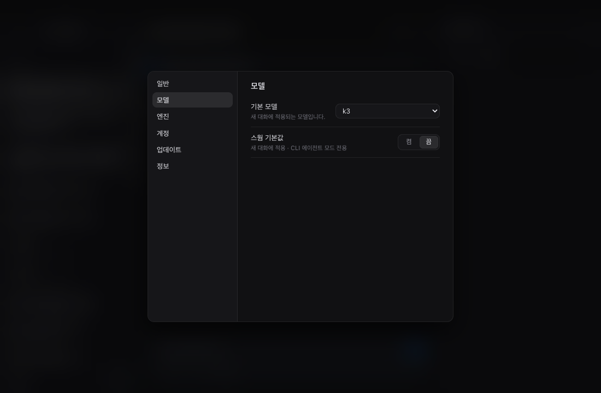

# kimi-gui


[GitHub](https://github.com/kaminion/kimi-gui) · [English](#english) · [한국어](#한국어)

> [!NOTE]
> **kimi-gui is a community project, not an official MoonshotAI product.** It uses the same local APIs and credentials as the Kimi Code CLI.

kimi-gui is an open-source desktop GUI that lets you use [Kimi Code](https://www.kimi.com) without the terminal. It runs on macOS and Windows, is built with Electron and plain JavaScript (ES2022, no bundler), follows Apple Human Interface Guidelines with a charcoal dark theme (light optional), and defaults to a Korean UI with full English support.

## Screenshots

| Chat view | Sidebar & groups |
| --- | --- |
|  |  |

| Usage | Settings |
| --- | --- |
|  |  |

## English

### Getting Started

**Requirements**

- Node.js 20 or later
- macOS or Windows
- Internet connection (sign-in, model responses, update checks)
- A Kimi membership

**Run from source**

```bash
npm install
npm start
```

**Build installers**

```bash
npm run dist
```

Artifacts are written to `dist/`: DMG + ZIP on macOS, NSIS installer + portable build on Windows.

> [!IMPORTANT]
> On first run, kimi-gui shows a splash screen and starts a browser device login — no CLI required. Credentials are stored in `~/.kimi-code/credentials`, shared with the Kimi Code CLI, so you log in once for both.

### Key Features

#### Two engines

kimi-gui ships with two interchangeable engines, switchable with one click in Settings (the app restarts):

| | Built-in engine (direct, default) | CLI agent mode |
| --- | --- | --- |
| Dependencies | None — runs entirely in the app | Kimi Code CLI (the app can install it for you) |
| Sign-in | In-app OAuth device flow (auth.kimi.com) | Shared CLI credentials |
| API | Direct to the Anthropic-compatible API (api.kimi.com/coding) | The full CLI via its local `kimi web` server |
| Tools | 6 local tools (Bash/Read/Write/Edit/Grep/Glob) with approval dialogs | The complete agent: swarm mode, sub-agents, plan mode |
| Thinking effort | off / low / high / max | Per CLI configuration |
| Sessions | Stored locally in a CLI-compatible wire format | CLI sessions |

#### Unified conversations

CLI-era sessions appear next to built-in ones in a single sidebar — open, continue, rename, or delete any of them. Create custom groups and organize sessions with drag & drop; anything ungrouped stays in the Recent section. Press ⌘F (Ctrl+F on Windows) for full-text search across all sessions, with jump-to-message navigation.

#### Agent work panel

A right-hand panel shows the agent's current state in real time: task list, recent tool activity, and changed files.

#### Composer option pills

Pills below the composer adjust the per-session model, swarm toggle (CLI agent mode), and thinking effort (off/low/high/max) without opening Settings.

#### Usage view

Today's token usage with a 7-day daily chart, weekly and 5-hour rolling quota bars, and per-session token and context-window stats.

#### And more

- Korean/English UI (한국어 기본)
- Charcoal dark theme, light optional
- Automatic update checks via GitHub Releases

### Architecture

The main-process **engine facade** (`main/backend.js`) routes every session/chat call to either the direct or the CLI engine; the selected engine is persisted in `<userData>/settings.json`. The preload script (`main/preload.js`) exposes a minimal `window.kimi` API via `contextBridge` — the renderer runs with `contextIsolation` on and no `nodeIntegration`.

Design and architecture contracts live in `docs/`:

- [ARCHITECTURE.md](ARCHITECTURE.md) — binding architecture contract
- [docs/protocol.md](docs/protocol.md) — `kimi web` REST + WebSocket protocol notes (CLI engine)
- [docs/oauth.md](docs/oauth.md) — device-flow login notes (built-in engine)
- [docs/direct-api.md](docs/direct-api.md) — Anthropic-compatible API notes (built-in engine)
- [docs/update.md](docs/update.md) — auto-update behavior and release process

### Development

```bash
npm install        # install dependencies
npm start          # run the app
npm run dist       # build installers into dist/
node --check main/backend.js   # syntax-check a file (per file; plain JS, no build step)
```

```
├── main/          # Electron main process (CommonJS): engine facade, auth,
│                  # direct client/store, CLI server manager, IPC, updater
├── renderer/      # UI (ES modules loaded via script tags): chat, sidebar,
│                  # settings, usage, search, i18n, styles
├── vendor/        # Bundled libraries (marked, highlight.js)
└── docs/          # Design/architecture contracts and protocol notes
```

### Known limitations

- **The built-in engine runs one turn at a time with 6 tools.** No swarm, sub-agents, or plan mode — use CLI agent mode for those.
- **Windows paths are untested.** NSIS/portable builds and the Windows CLI installer path have not been verified on a real Windows machine.
- **Dev builds are unsigned.** macOS shows a Gatekeeper warning, and auto-update installation can fail without code signing and notarization.
- **Some main-process error strings are Korean-only** (e.g. login progress, CLI install progress).

## 한국어

> [!NOTE]
> **kimi-gui는 커뮤니티 프로젝트이며, MoonshotAI의 공식 제품이 아닙니다.** Kimi Code CLI와 동일한 로컬 API와 자격증명을 사용합니다.

kimi-gui는 [Kimi Code](https://www.kimi.com)를 터미널 없이 사용할 수 있게 해주는 오픈소스 데스크톱 GUI입니다. macOS와 Windows에서 동작하며, Electron과 순수 JavaScript(ES2022, 번들러 없음)로 작성했습니다. Apple Human Interface Guidelines 기반의 차콜 다크 테마(라이트 옵션)를 적용했고, 한국어 UI가 기본이며 English를 완전히 지원합니다.

### 시작하기

**요구사항**

- Node.js 20 이상
- macOS 또는 Windows
- 인터넷 연결 (로그인, 모델 응답, 업데이트 확인에 필요)
- Kimi 멤버십

**소스에서 실행**

```bash
npm install
npm start
```

**설치 파일 빌드**

```bash
npm run dist
```

빌드 산출물은 `dist/`에 생성됩니다: macOS는 DMG + ZIP, Windows는 NSIS 설치 프로그램 + 포터블 빌드입니다.

> [!IMPORTANT]
> 첫 실행 시 스플래시 화면이 표시되고 브라우저 device 로그인이 시작됩니다 — CLI가 필요 없습니다. 자격증명은 `~/.kimi-code/credentials`에 저장되어 Kimi Code CLI와 공유되므로, 한 번만 로그인하면 양쪽에서 모두 사용할 수 있습니다.

### 주요 기능

#### 두 가지 엔진

kimi-gui는 두 가지 교체 가능한 엔진을 제공하며, 설정에서 한 번의 클릭으로 전환할 수 있습니다(앱이 다시 시작됩니다):

| | 내장 엔진 (direct, 기본) | CLI 에이전트 모드 |
| --- | --- | --- |
| 의존성 | 없음 — 앱 안에서 완결 | Kimi Code CLI (앱이 설치를 지원) |
| 로그인 | 인앱 OAuth device flow (auth.kimi.com) | CLI와 공유되는 자격증명 |
| API | Anthropic 호환 API(api.kimi.com/coding)에 직접 통신 | 로컬 `kimi web` 서버를 통해 완전한 CLI 구동 |
| 도구 | 승인 다이얼로그를 거치는 로컬 도구 6종 (Bash/Read/Write/Edit/Grep/Glob) | 완전한 에이전트: 스웜, 서브에이전트, 플랜 모드 |
| 사고 수준 | 끄기 / 낮음 / 높음 / 최대 | CLI 설정에 따름 |
| 세션 | CLI 호환 wire 형식으로 로컬 저장 | CLI 세션 |

#### 통합된 대화

CLI 시절의 세션이 내장 엔진 세션과 나란히 하나의 사이드바에 표시됩니다 — 열기, 이어하기, 이름 변경, 삭제 모두 가능합니다. 커스텀 그룹을 만들어 드래그 앤 드롭으로 세션을 정리할 수 있고, 그룹에 속하지 않은 세션은 최근 내역에 남습니다. ⌘F(Windows: Ctrl+F)로 전체 세션을 대상으로 전문 검색을 수행하고, 결과를 클릭하면 해당 메시지 위치로 이동합니다.

#### 에이전트 작업 패널

우측 패널에서 에이전트의 현재 상태를 실시간으로 확인할 수 있습니다: 작업 목록, 최근 도구 활동, 변경된 파일.

#### 입력창 옵션 pill

입력창 아래의 pill에서 설정을 열지 않고도 세션별 모델, 스웜(CLI 에이전트 모드), 사고 수준(끄기/낮음/높음/최대)을 바로 조정합니다.

#### 사용량 화면

오늘의 토큰 사용량과 최근 7일 일별 차트, 주간 및 5시간 롤링 한도 바, 세션별 토큰·컨텍스트 윈도우 사용량을 표시합니다.

#### 그 외

- 한국어/English UI (기본 한국어)
- 차콜 다크 테마, 라이트 옵션
- GitHub Releases 기반 자동 업데이트 확인

### 아키텍처

main 프로세스의 **엔진 파사드**(`main/backend.js`)가 모든 세션/채팅 호출을 direct 또는 CLI 엔진으로 라우팅하며, 선택된 엔진은 `<userData>/settings.json`에 저장됩니다. preload 스크립트(`main/preload.js`)는 `contextBridge`를 통해 최소한의 `window.kimi` API만 노출합니다 — renderer는 `contextIsolation`이 켜진 채 `nodeIntegration` 없이 동작합니다.

설계·아키텍처 계약 문서는 `docs/`에 있습니다:

- [ARCHITECTURE.md](ARCHITECTURE.md) — 아키텍처 계약 (binding)
- [docs/protocol.md](docs/protocol.md) — `kimi web` REST + WebSocket 프로토콜 노트 (CLI 엔진)
- [docs/oauth.md](docs/oauth.md) — device flow 로그인 노트 (내장 엔진)
- [docs/direct-api.md](docs/direct-api.md) — Anthropic 호환 API 노트 (내장 엔진)
- [docs/update.md](docs/update.md) — 자동 업데이트 동작 및 배포 절차

### 개발

```bash
npm install        # 의존성 설치
npm start          # 앱 실행
npm run dist       # 설치 파일을 dist/에 빌드
node --check main/backend.js   # 파일 단위 문법 검사 (순수 JS, 빌드 단계 없음)
```

```
├── main/          # Electron main 프로세스 (CommonJS): 엔진 파사드, 인증,
│                  # direct 클라이언트/저장소, CLI 서버 관리자, IPC, 업데이터
├── renderer/      # UI (script 태그로 로드하는 ES 모듈): 채팅, 사이드바,
│                  # 설정, 사용량, 검색, i18n, 스타일
├── vendor/        # 번들 라이브러리 (marked, highlight.js)
└── docs/          # 설계/아키텍처 계약 및 프로토콜 노트
```

### 알려진 제한

- **내장 엔진은 도구 6종으로 한 번에 하나의 턴(에이전트 루프)만 처리합니다.** 스웜, 서브에이전트, 플랜 모드는 지원하지 않습니다 — 이런 기능은 CLI 에이전트 모드를 사용하세요.
- **Windows 경로는 미검증 상태입니다.** NSIS/포터블 빌드와 Windows용 CLI 자동 설치 경로는 실제 Windows 환경에서 검증되지 않았습니다.
- **개발 빌드는 서명되어 있지 않습니다.** macOS에서 Gatekeeper 경고가 표시되며, 코드 서명·공증 없이는 자동 업데이트 설치가 실패할 수 있습니다.
- **일부 main 프로세스 오류 문자열은 한국어로만 표시됩니다** (로그인 진행, CLI 설치 진행 등).
