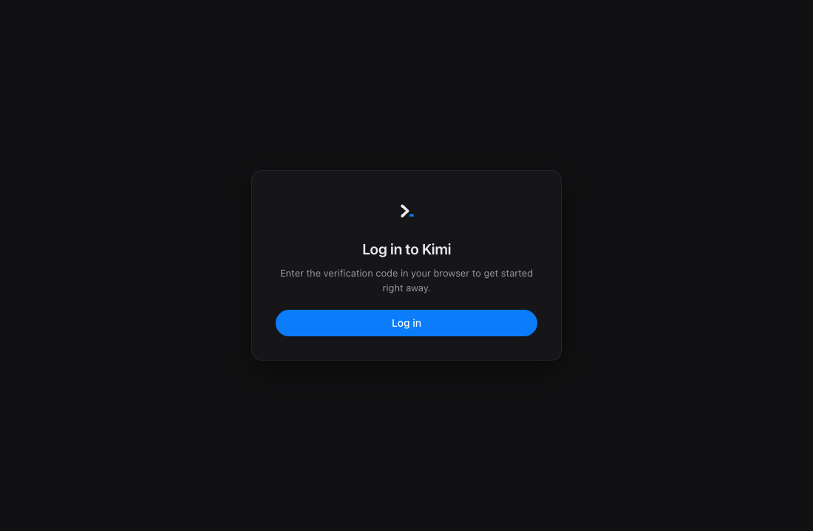
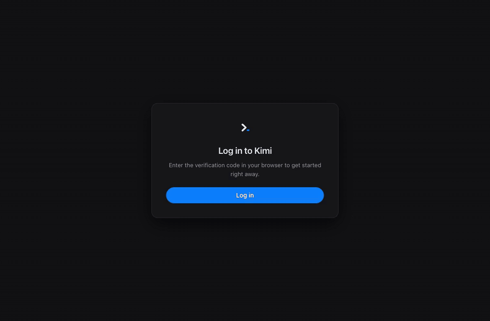

# kimi-gui [](./package.json) [](https://github.com/kaminion/kimi-gui/graphs/commit-activity) [](#requirements)

[Kimi Code](https://www.kimi.com/code/) | [GitHub](https://github.com/kaminion/kimi-gui) | [한국어](./README.ko.md)

> [!IMPORTANT]
> **kimi-gui is an independent community project, not an official Moonshot AI product.** It uses Kimi Code APIs and the same local credentials as the official Kimi Code CLI.

kimi-gui is a desktop interface for [Kimi Code](https://www.kimi.com/code/). Sign in with your Kimi account, then use conversations, model and thinking controls, agent activity, search, and usage visibility in a focused Electron app—without requiring a terminal.

## Getting Started

### Requirements

- Node.js 20 or later
- macOS or Windows
- A Kimi membership
- Internet access for sign-in and model responses

### Sign in and start

Launch kimi-gui, select **Log in**, and complete Kimi's verification in your browser. That's it—the default built-in engine works without installing or configuring the Kimi Code CLI.



Your credentials are stored under `~/.kimi-code/credentials` and can be shared with Kimi Code CLI, so one Kimi sign-in works across both experiences.

### Run from source

```sh
git clone https://github.com/kaminion/kimi-gui.git
cd kimi-gui
npm install
npm start
```

To build a local installer:

```sh
npm run dist
```

macOS builds produce DMG and ZIP artifacts. Windows builds produce an NSIS installer and a portable executable under `dist/`.

## Key Features

### A desktop workflow for Kimi Code

Start a conversation, watch thinking and answer tokens stream in, inspect agent state, and review token usage without leaving the app.

The demo starts with one-time Kimi sign-in, confirms the shared account and both engine choices, then follows a real built-in response into Agent activity and Usage.



### Kimi Code, `kimi web`, and kimi-gui

[Kimi Code](https://www.kimi.com/code/) is the underlying coding service. `kimi web` is an official Kimi Code CLI command that exposes the CLI runtime as a local REST and WebSocket service. kimi-gui is an independent Electron desktop client that offers two ways to use them: connect directly to the Kimi Code API, or manage `kimi web` for the full CLI agent workflow.

Switch engines from Settings. The app restarts into the selected mode and keeps both kinds of sessions visible.

| | Built-in engine (default) | CLI agent mode |
| --- | --- | --- |
| Runtime | Runs directly inside kimi-gui | Official Kimi Code CLI, launched and managed by the app |
| Dependency | No CLI installation required | Kimi Code CLI installed locally |
| Transport | Direct Kimi Code API connection | Local REST + WebSocket through `kimi web` |
| Sign-in | One Kimi login, shared with the CLI | The same shared Kimi credentials |
| Tools | Bash, Read, Write, Edit, Grep, and Glob | Full CLI agent toolset |
| Agent features | Single-agent turns with approvals | Plan mode, sub-agents, and swarm |
| Thinking | Off, low, high, or max | Per-session CLI configuration |

### Unified conversations

Built-in and CLI sessions share one sidebar. Continue compatible sessions, rename or remove conversations, create groups with drag and drop, and search the full transcript with `⌘F` or `Ctrl+F`.

### Controls next to the prompt

Choose a model and thinking effort per conversation from compact composer controls. CLI agent mode also exposes a swarm toggle. A live context meter shows how much of the active model window is in use.

### Agent activity and usage

File edits are shown as GPT/Codex-style change cards in the conversation, with
per-file diffs and added/deleted line counts. A compact summary below the
composer reports the number of changed files and cumulative `+`/`-` totals.
Selecting it opens the single right-side panel on its **Changes** tab; switch to
**Activity** in the same panel to see current status, tasks, tool activity, and
touched files.

The Usage view combines daily input/output totals, a seven-day chart, rolling
quota windows, and current-session token counts.

### Desktop details

- English and Korean UI
- Dark and light themes
- Markdown, syntax highlighting, and collapsible thinking blocks
- Native directory picker and approval dialogs
- Automatic update checks through GitHub Releases

## Architecture

The Electron main process exposes a narrow IPC bridge to a sandboxed renderer. `main/backend.js` is the engine facade: it routes sessions and prompts either to the built-in direct API client or to the official CLI through a local `kimi web` service, while keeping the renderer engine-agnostic.

```text
main/       Electron lifecycle, engines, auth, sessions, IPC, updates
renderer/   Plain JavaScript UI, chat, sidebar, search, settings, usage
vendor/     Bundled Markdown and syntax-highlighting libraries
docs/       Architecture, protocol, OAuth, API, and design notes
```

Technical references:

- [Architecture contract](./ARCHITECTURE.md)
- [Direct API notes](./docs/direct-api.md)
- [`kimi web` protocol notes](./docs/protocol.md)
- [OAuth device-flow notes](./docs/oauth.md)
- [Update behavior](./docs/update.md)

## Development

The project uses CommonJS in the Electron main process and plain browser scripts in the renderer—there is no application bundler.

```sh
npm install
npm start

# Build platform installers
npm run dist

# Syntax-check an edited main-process file
node --check main/backend.js
```

## Known Limitations

- Built-in mode runs one agent turn at a time; use CLI agent mode for plan mode, sub-agents, and swarm.
- Windows packaging is configured but has not been verified on physical Windows hardware.
- Development builds are unsigned, so macOS Gatekeeper may warn on first launch.
